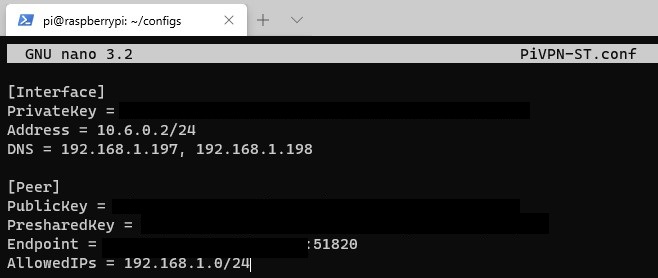

- [ref1](https://www.wundertech.net/setup-wireguard-on-a-raspberry-pi-vpn-setup-tutorial/)

---

### Config Client

> The only change that we have to make here is the AllowedIPs line. By default, AllowedIPs is set as 0.0.0.0/0 which means that all traffic will go through your home network (full-tunnel VPN). To change this so that only local traffic is sent through WireGuard, we need to change this line to our local IP range.

> For most people, it will be 192.168.1.0/24 or 192.168.0.0/24. If you aren’t sure what your IP range is, you can look in your router’s configuration under LAN Setup. If you’d like to have VPN clients talk to each other, you need to add the VPN subnet as well (10.6.0.0/24). Change this file to have your local IP range and save it.

